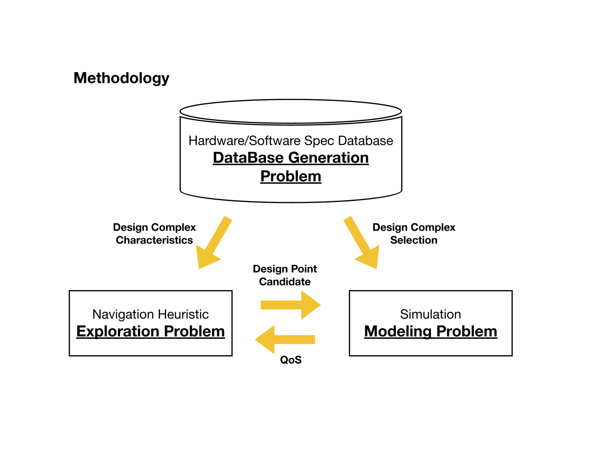
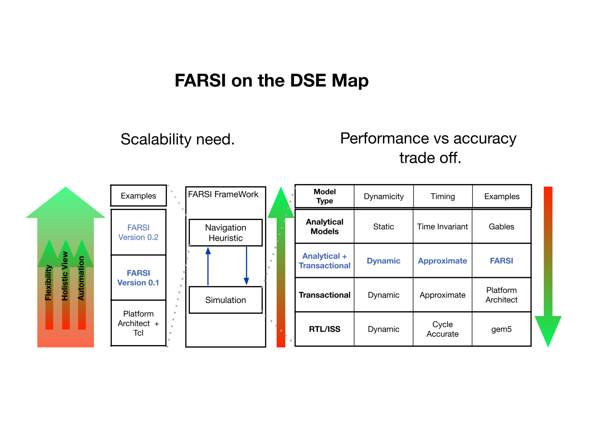

# Project_FARSI
FARSI is a agile pre-rtl design space exploration framework. It allows SOC designers to find optimal
designs given a set of constraints (performance/power/area and development cost).


## How Does it work
To solve the aforementioned problem, FARSI solves 3 problems simultaneously (figure bellow) using
3 main components:
* (1) A simulator to capture the behavior of the SOC.
* (2) An exploration heuristic to navigate the design space in an optimal fashion.
* (3) A database populated by the designer with workloads (e.g., hand tracking, ...), and the
possible hardware options (e.g., general purpose processors, accelerators, memory, etc).

FARSI continuously samples the database to generate a sample design, simulates its fitness and uses its navigation heuristic to get closer to the optimal design.




## Why FARSI
FARSI is developed to overcome the existing DSE problems such as scalability and performance.
To further clarify this, the figure below puts FARSI on the map compared to the other DSEs.



## Building/Installing FARSI
FARSI is a python based source code. Hence, relevant python libraries need to be installed.


## FARSI Input
Software/hardware database shown above is used as an input to FARSI's framework. Here we briefly explain their functionality and encoding. 

**Software Database:** This includes labeled task dependency graphs (TDG). A task is the smallest optimization unit and is typically selected from the computationally intensive functions since they significantly impact the system behavior. TDG contains the dependency information between tasks, the number of instructions processed within a task, and the data movement between them.
 
**Hardware Database**: This involves power, performance, and area estimation of each task for different hardware mappings (e.g., to general-purpose processors or specialized accelerators).

### FARSI Input Encoding:
Although the semantics discussed above can be encoded and inputted in various formats, currently, our front-end parsers take them in the form of spreadsheets. Here we detail these sheets. Please note that examples of these sheets are provided in the specs/database_data/parsing folder. 

Each workload has its set of spreadsheet whose name starts with the $workload name$_database, e.g., audio_decoder_database.

**Software Database Spreadsheets**

*Task Data Movement:* contains information about the data movement between tasks and their execution dependency. This sheet is an adjacency matrix format, where the first row and the first column list the workload's tasks. The cell at the coordinate between two tasks shows the data movement among them. Note that data flows from the task shown in the row to the task shown in the column. Also, note that this format implies the execution dependency between tasks if said cells are non-empty. 

*Task instruction count:* contains information about each task's computation, specifically quantifying its non-memory instruction count.

*Task Itr Count:*  each task's loop iteration count.

**Hardware Database Spreadsheets**

*Task PE Performance:* Performance (in the number of cycles) associated with mapping of tasks to different processing elements (PEs).

*Task PE Energy:* Energy associated with the accelerator running a task.

*Task Area Performance:* Area associated with accelerators.

*misc_database - Budget:* budget (power, performance, area) associated with various workloads.

*misc_database - Block Characteristics:* contains information about the potential IPs used in the system. These are non-task specific IPs (as opposed to accelerators that are task-specific and whose information is provided in the TASK PE (AREA/Energy/Performance) spreadsheets.).

*misc_database - Last Tasks.csv:* name of the last task within each workload.

**Mapping Database Spreadsheets**

*Hardware Graph:* contains information about how hardware components are connected. It's an adjacency matrix with the first row and the first column specifying the hardware block names. a **1** in the cell at the coordinate between two blocks indicates a connection between said blocks.

*Task To Hardware Mapping:* contains information about which hardware blocks various tasks are mapped to. The first row specifies the hardware block names, and the first column specifies the software task names. If a task is mapped onto a hardware block, it is listed under that block. We follow two conventions within this spread sheet. 
  1) Under the NoC and Memory blocks,  direction of the accesses (read or write) needs to be specified, and this is denoted by an arrow **->**.
     For example, a cell that contains **Task1 -> Task2** under a memory **M0** cell indicates that **Task1 data is written into M0 and furthermore, this data will be read by Task2 (as Task1's child)**. Please note that only the write direction is specified, and the read direction is implied from the writes, as was shown in the previous example.
  2) If multiple tasks are mapped to the same block, we separate them with a semicolon. 


## Running FARSI

### Stand Alone Simulation ###
The following commands allows the user to run the simulation in standalone mode.

Switch into the bellow directory.
```shell
cd data_collection/collection_utils/sim_run/
```
Set the workload name in the simple_sim_run.py (by default we choose a simple workload) and run the simulation.

```shell
python simple_sim_run.py
```

The output data will be provided under the data_collection/data/simple_sim_run/$date_time$ folder


### Simulation + Exploration Heuristic ###
The following commands allow the user to run both the simulation and exploration simulatenously. 

Switch into bellow directory.
```shell
cd data_collection/collection_utils/what_ifs/
```
Set the workload name properly in FARSI_what_ifs_with_params.py (Select among, audio_decoder, hpvm_cava, and edge_detection) and run FARSI. 

```shell
python FARSI_what_ifs_with_params.py   # run FARSI
```

PS: To modify the settings, modify the settings/config.py file. This file contains many knobs that will determine the exploration heuristic and simulation
features. Please refer to the in file documentations for more details

output will be provided under data_collection/data/simple_run/$date_time$

## Main Contributors
Behzad Boroujerdian\
Ying Jing


## How to Cite
@article{10.1145/3544016,
author = {Boroujerdian, Behzad and Jing, Ying and Tripathy, Devashree and Kumar, Amit and Subramanian, Lavanya and Yen, Luke and Lee, Vincent and Venkatesan, Vivek and Jindal, Amit and Shearer, Robert and Reddi, Vijay Janapa},
title = {FARSI: An Early-Stage Design Space Exploration Framework to Tame the Domain-Specific System-on-Chip Complexity},
year = {2022},
publisher = {Association for Computing Machinery},
url = {https://doi.org/10.1145/3544016},
doi = {10.1145/3544016},
journal = {ACM Trans. Embed. Comput. Syst.},
month = {may}
}


## License
Copyright (c) Facebook, Inc. and its affiliates.
This source code is licensed under the MIT license found in the
LICENSE file in the root directory of this source tree.


