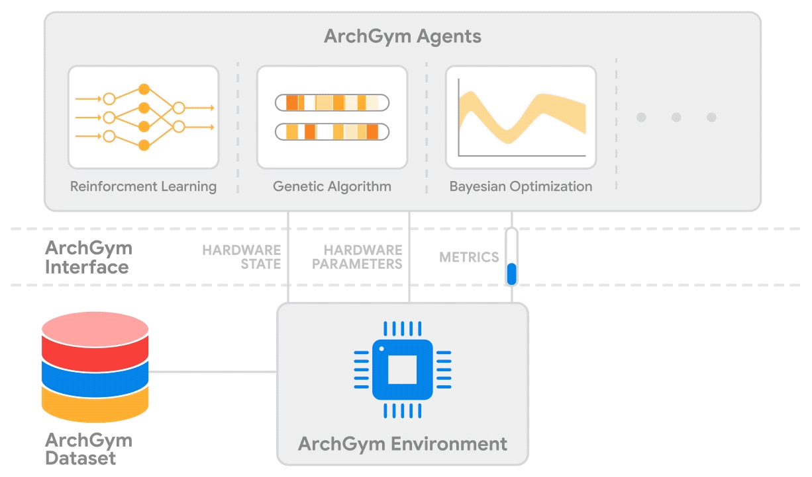

.. ArchGym documentation master file, created by
   sphinx-quickstart on Sat Aug 12 19:58:47 2023.
   You can adapt this file completely to your liking, but it should at least
   contain the root `toctree` directive.

Welcome to ArchGym's documentation!
===================================

.. toctree::
   :maxdepth: 1
   :caption: Contents:

   intro
   installation
   Vizier_Installation
   environments
   agents
   proxy-pipeline
   source_code

Indices and tables
==================

* :ref:`genindex`
* :ref:`modindex`
* :ref:`search`
