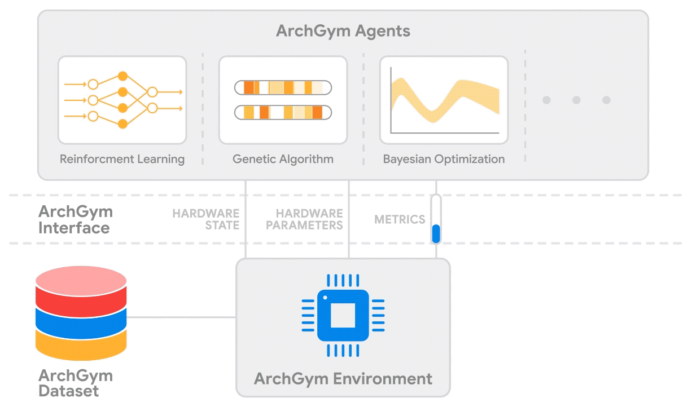

Introduction
============

We introduce ArchGym, an open-source gymnasium and easy-to-extend framework that connects a diverse range of search algorithms to
architecture simulators. The results suggest that with an unlimited number of samples, ML algorithms are equally favorable to meet the user-defined target specification
if its hyperparameters are tuned thoroughly; no one solution is necessarily better than another. We show how using a same structure of code for different algirthms, 
we can train the agent to generate optimal parameters just by varying the name of the algorithm. 
ArchGym is a systematic and standardized framework for ML-driven research tackling architectural design space exploration. ArchGym currently supports (six) different ML-based search algorithms and three unique architecture simulators.