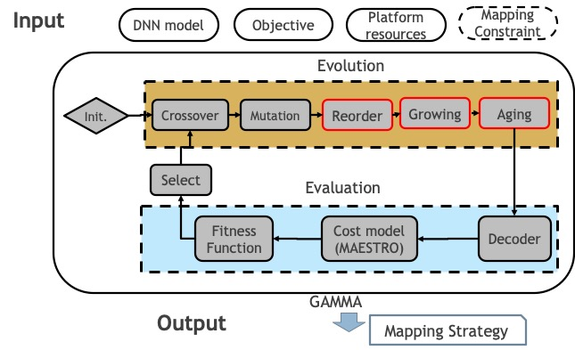

# GAMMA #
This is the implementation of the paper [GAMMA](https://dl.acm.org/doi/10.1145/3400302.3415639),
GAMMA is an autonomous framework for optimizing the HW mapping of DNN models on the DNN Accelerators.
We use [MAESTRO](http://maestro.ece.gatech.edu/) as our cost model.



### Extended Works
This code repository also incorporates the code-bases of the extended works:
* [DiGamma](https://arxiv.org/pdf/2201.11220.pdf)
* [Formalism of Accelerator Flexibility](https://dl.acm.org/doi/10.1145/3530907)
------------------------------------------------------
### Sister Repo: Gamma-Timeloop 
* We also have GAMMA supporting [Timeloop](https://github.com/NVlabs/timeloop) as cost model. The sister repo can be found here -- [Gamma-Timeloop](https://github.com/maestro-project/gamma-timeloop).
  
  It enables using GAMMA algorithm to search through the design space of Timeloop, a DNN cost model from NVIDIA.
----------------

## Installation ##
* Create virtual env
```
conda create --name gammaEnv python=3.6
conda activate gammaEnv
```
* Install requirement
```
pip install -r requirements.txt
```

* Download cost model and build symbolic link
```
python build.py
```

* Setup larger limitation for opened file if there is warning "Too many open files." (for threading)
```
ulimit -n 4096
```

### Take a Trial Run ###
```
./run_gamma.sh
```
----------------

### Different Map Space Exploration Scenarios ###
* Map space exploration for fully flexible accelerator (in a full search space): Related reading - [GAMMA](https://dl.acm.org/doi/10.1145/3400302.3415639).
* Map space exploration for partially flexible accelerator (in a constrained search space): Related reading - [Formalism of Accelerator Flexibility](https://dl.acm.org/doi/10.1145/3530907).
* PE(HW)-Mapping Co-exploration: Related reading - [DiGamma](https://arxiv.org/pdf/2201.11220.pdf).

More details can be found [here](./src/GAMMA/)

### Resources
* Tutorial of GAMMA, in IEEE/ACM International Symposium on Microarchitecture (MICRO), 2020 [[video](https://www.youtube.com/watch?v=gfBFRBbcA10)]
* GAMMA paper presentation, in IEEE/ACM International Conference On Computer Aided Design (ICCAD), 2020 [[video](https://www.youtube.com/watch?v=Q7oJBJmVbGw)]

### Contributor ###
* Sheng-Chun (Felix) Kao
* Tushar Krishna

### Pull Request ###
* We welcome pull request.
* If you have any question, please contact Felix <chuchu40507@gmail.com>.

### Citation ###
```
@inproceedings{gamma,
    author       = {Kao, Sheng-Chun and Krishna, Tushar},
    title        = {GAMMA: Automating the HW Mapping of DNN Models on Accelerators via Genetic Algorithm},
    booktitle     = {ICCAD},
  year          = {2020}
}

```
```
@inproceedings{digamma,
title={DiGamma: Domain-aware Genetic Algorithm for HW-Mapping Co-optimization for DNN Accelerators},
author={Kao, Sheng-Chun and Pellauer, Michael and Parashar, Angshuman and Krishna, Tushar},
booktitle     = {DATE},
year={2022}
}
```
```
@inproceedings{kao2022formalism,
  title={A Formalism of DNN Accelerator Flexibility},
  author={Kao, Sheng-Chun and Kwon, Hyoukjun and Pellauer, Michael and Parashar, Angshuman and Krishna, Tushar},
  booktitle={Proceedings of the 2022 ACM SIGMETRICS/IFIP PERFORMANCE Joint International Conference on Measurement and Modeling of Computer Systems},
  year={2022}
}
```
